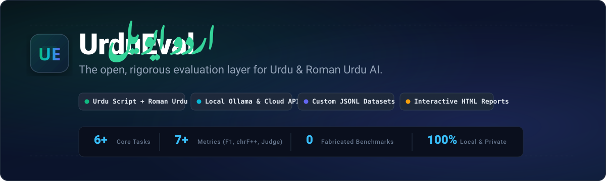
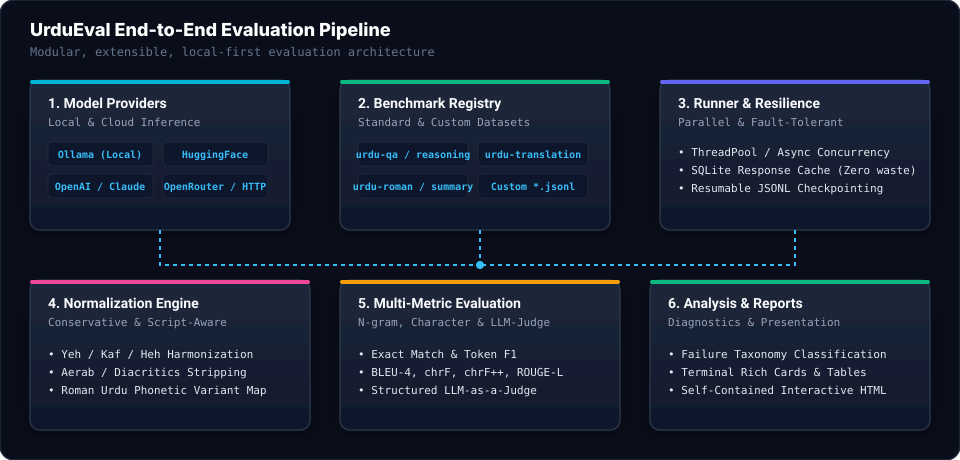
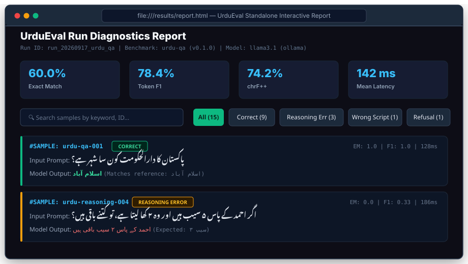

<div align="center">



<br/>

[](https://pypi.org/project/urdu-eval/)
[](https://www.python.org/)
[](LICENSE)
[](tests/)
[](tests/)
[](https://github.com/astral-sh/ruff)
[](https://github.com/python/mypy)

**Measure how well AI models understand, reason, translate, and speak Urdu.**

[Quick Start](#-quick-start) • [Live Demo](#-terminal-in-action) • [Architecture](#-architecture) • [Custom Datasets](#-custom-datasets) • [Metrics & Normalization](#-normalization--linguistic-nuance) • [Interactive Reports](#-interactive-reports) • [Leaderboard](#-comparative-leaderboard)

</div>

---

## 🌟 What is UrduEval?

Urdu is spoken by over **230 million people worldwide**, yet mainstream AI evaluation harnesses treat it as an afterthought. Standard benchmarks fail on Urdu because:
- **Orthographic Inconsistencies**: Variations in Persian/Arabic Kaf (`ک` vs `ك`), Yeh (`ی` vs `ي` vs `ے`), and Heh (`ہ` vs `ھ` vs `ة`).
- **Diacritics & Aerab**: Zabar, Zer, Pesh, Tashdeed are inconsistently present or omitted in digital text.
- **Roman Urdu Orthography**: Millions communicate using Latin script (`"Pakistan aik azeem mulk hai"`), where phonetic spelling varies widely without standard dictionaries (`"khubsurat"` vs `"khoobsurat"` vs `"khobsurat"`).
- **Silent Language Drift**: Models frequently switch to Arabic, Hindi, or English mid-sentence when prompted in Urdu.

**UrduEval** is the **open, rigorous evaluation layer** built specifically to solve these challenges. It provides a modular, reproducible evaluation harness for testing local LLMs (via Ollama or HuggingFace) and cloud models (OpenAI, Anthropic, OpenRouter) against Urdu script, Roman Urdu, and cross-lingual tasks.

---

## 🎬 Terminal in Action

<div align="center">
  
  <p><em>Watch UrduEval evaluate an Ollama model on Urdu QA with live progress, metrics, and error diagnostics.</em></p>
</div>

---

## 🚀 Quick Start

### 1. Installation

Install the lightweight core package with zero heavyweight ML bloat:

```bash
pip install urdu-eval
```

For your preferred model providers:

```bash
pip install "urdu-eval[ollama]"     # Local Ollama models (Free & Private)
pip install "urdu-eval[openai]"     # OpenAI (GPT-4o, GPT-4o-mini)
pip install "urdu-eval[anthropic]"  # Anthropic (Claude 3.5 Sonnet)
pip install "urdu-eval[hf]"         # Local HuggingFace Transformers
pip install "urdu-eval[all]"        # Install all optional providers
```

Verify your installation:

```bash
urdu-eval --help
```

---

### 2. Inspect Available Benchmarks & Providers

Check built-in benchmarks and active model providers:

```bash
urdu-eval benchmarks
urdu-eval providers
```

| Benchmark ID | Task | Script | Development Samples | Description |
|---|---|---|:---:|---|
| `urdu-qa` | Question Answering | Urdu Script | 15 | Factual QA spanning history, science, geography, and culture |
| `urdu-reasoning` | Multi-step Reasoning | Urdu Script | 12 | Math, syllogisms, and commonsense reasoning in Urdu |
| `urdu-translation` | Bidirectional Translation | Urdu & English | 12 | Urdu-to-English & English-to-Urdu with BLEU and chrF++ |
| `urdu-summary` | Text Summarization | Urdu Script | 10 | News articles and literature summarization |
| `urdu-roman` | Roman Urdu Understanding | Roman Urdu (Latin) | 12 | Conversational Roman Urdu QA and comprehension |
| `urdu-mmlu` | Multi-subject MCQA | Urdu Script | 12 | Curated sample of humanities, STEM, and social sciences |

> [!NOTE]
> **Methodological Honesty**: Built-in benchmark suites contain carefully verified **development samples (10–15 items)** intended for smoke testing and regression testing. They are **not** presented as official academic leaderboards. For large-scale evaluations, point UrduEval to your own JSONL files or public dataset adapters (`UrduMMLUAdapter`, `UrduBenchAdapter`).

---

### 3. Run Your First Evaluation

#### A. Free Local Models via Ollama (Zero Cost, 100% Private)
Make sure [Ollama](https://ollama.ai) is running locally:

```bash
urdu-eval run --provider ollama --model llama3.1 --benchmark urdu-qa
```

#### B. OpenAI Models
Set your `OPENAI_API_KEY`:

```bash
urdu-eval run --provider openai --model gpt-4o-mini --benchmark urdu-qa
```

#### C. Anthropic Claude
Set your `ANTHROPIC_API_KEY`:

```bash
urdu-eval run --provider anthropic --model claude-3-5-sonnet-20241022 --benchmark urdu-reasoning
```

#### D. OpenRouter (DeepSeek R1, Llama 3.3, Qwen 2.5)
Set your `OPENROUTER_API_KEY`:

```bash
urdu-eval run --provider openrouter --model deepseek/deepseek-r1 --benchmark urdu-translation
```

#### E. Offline Mock Provider (For CI/CD and Pipeline Verification)
```bash
urdu-eval run --provider mock --benchmark urdu-qa
```

---

## 🏗 Architecture

UrduEval separates dataset loading, model invocation, linguistic normalization, metric scoring, failure diagnostics, and reporting into clean, decoupled layers:

<div align="center">
  
</div>

---

## 📂 Custom Datasets

Evaluating your own custom Urdu data is a first-class feature in UrduEval. **Zero Python code is required.**

### 1. JSONL Data Format

Prepare a UTF-8 encoded `.jsonl` file where each line is a JSON object matching this schema:

```json
{"id": "custom-001", "prompt": "علامہ اقبال کا تعلق کس شہر سے تھا؟", "reference": "سیالکوٹ", "task": "qa", "script": "urdu"}
{"id": "custom-002", "prompt": "Pakistan ka qaumi khel konsa hai?", "reference": "Hockey", "task": "qa", "script": "roman_urdu"}
{"id": "custom-003", "prompt": "درج ذیل جملے کا انگریزی میں ترجمہ کریں: محنت میں عظمت ہے۔", "reference": "There is dignity in hard work.", "task": "translation", "script": "urdu"}
```

### 2. Validate Dataset Before Running

Validate your dataset for UTF-8 encoding, schema validity, duplicate IDs, and script consistency:

```bash
urdu-eval validate my_dataset.jsonl
```

Output:
```text
✓ Encoding: UTF-8 (No BOM)
✓ Syntax: Valid JSONL (150 samples)
✓ Schema: All required fields present
✓ Script Integrity: 100% compliant with declared script
Dataset is 100% valid and ready for evaluation!
```

### 3. Run Evaluation on Your Dataset

```bash
urdu-eval run \
  --provider ollama \
  --model llama3.1 \
  --dataset my_dataset.jsonl \
  --metrics exact_match,f1,chrf \
  --workers 4
```

---

## 🔤 Normalization & Linguistic Nuance

Standard string comparison fails on Urdu. UrduEval includes **conservative, linguistically principled normalizers**:

### Urdu Script Normalization (`urdu_eval.normalization.urdu`)
1. **Character Harmonization**:
   - Arabic Kaf (`ك` `\u0643`) ➔ Urdu Kaf (`ک` `\u06a9`)
   - Arabic Yeh (`ي` `\u064a`) ➔ Urdu Choti Yeh (`ی` `\u06cc`)
   - Arabic Ta Marbuta (`ة` `\u0629`) ➔ Urdu Gol Heh (`ہ` `\u06c1`)
   - Do-Chashmi Heh (`ھ` `\u06be`) is strictly preserved for aspirated consonants (`بھ`, `پھ`, `تھ`).
2. **Aerab / Diacritics Stripping**:
   - Zabar (`\u064e`), Zer (`\u0650`), Pesh (`\u064f`), Tashdeed (`\u0651`), Jazm (`\u0652`), etc.
3. **Numerals Normalization**:
   - Harmonizes Eastern Arabic-Indic numerals (`۰۱۲۳۴۵۶۷۸۹`) with standard Urdu digits (`۰۱۲۳۴۵۶۷۸۹`).

### Roman Urdu Normalization (`urdu_eval.normalization.roman_urdu`)
- Lowercasing and strip non-alphanumeric punctuation.
- Vowel elongation collapsing (`"bohhht khooob"` ➔ `"boht khob"`).
- Phonetic variant grouping (`"khubsurat"` vs `"khoobsurat"` vs `"khubsoorat"`).

---

## 📊 Comprehensive Metrics

UrduEval provides specialized evaluation metrics:

| Metric | CLI Flag | Best For | Description |
|---|---|---|---|
| **Exact Match** | `exact_match` | QA, MCQA | Normalized string equality check |
| **Token F1** | `f1` | QA, Extraction | Harmonic mean of token precision and recall with Urdu punctuation tokenization |
| **chrF / chrF++** | `chrf` | Translation, Generation | Character n-gram F-score with word 2-grams (recommended for morphologically rich languages like Urdu) |
| **BLEU-4** | `bleu` | Translation | Standard 1-to-4 n-gram precision with brevity penalty |
| **ROUGE-L** | `rouge-l` | Summarization | Longest Common Subsequence (LCS) overlap score |
| **LLM-as-a-Judge** | `judge` | Open-Ended, Reasoning | Structured rubric scoring (0.0 to 1.0) with multi-attribute criteria and JSON verification |

---

## 🔍 Failure Diagnostics & Error Taxonomy

UrduEval automatically categorizes every sample result into a principled **failure taxonomy**:

```text
┌─────────────────────────────────────────────────────────────┐
│                    Sample Evaluation                        │
└──────────────────────────────┬──────────────────────────────┘
                               │
               ┌───────────────┴───────────────┐
               ▼                               ▼
       Metric Pass (≥ 0.8)             Metric Fail (< 0.8)
               │                               │
           [Correct]            ┌──────────────┴──────────────┐
                                ▼                             ▼
                         Model Refusal                 Linguistic Slip
                         ("I cannot...")             (Script Drift / Arabization)
                                │                             │
                            [Refusal]                  [Wrong Script]
                                                              │
                                                ┌─────────────┴─────────────┐
                                                ▼                           ▼
                                        Translation Drift           Reasoning Error
                                      (Target lang mismatch)     (Calculation/Logic slip)
```

---

## 📑 Interactive Reports

Generate a self-contained, interactive HTML report with search filters, KPI cards, and sample-level inspection:

<div align="center">
  
</div>

```bash
# Generate report for a run
urdu-eval report results/run_20260917_urdu_qa/scores.json --html results/report.html
```

Open `results/report.html` in any web browser. **Zero external JavaScript dependencies, works completely offline.**

---

## 🏆 Comparative Leaderboard

UrduEval aggregates runs into a unified comparative leaderboard:

```bash
urdu-eval leaderboard
```

```text
╭──────┬────────────────────────────┬────────────┬─────────────────────┬─────────┬─────────────┬────────┬─────────┬────────────╮
│ Rank │ Model                      │ Provider   │ Benchmark           │ Samples │ EXACT_MATCH │     F1 │ Latency │ Date       │
├──────┼────────────────────────────┼────────────┼─────────────────────┼─────────┼─────────────┼────────┼─────────┼────────────┤
│    1 │ gpt-4o                     │ openai     │ urdu-qa (v0.1.0)    │      15 │       80.0% │  89.2% │   320ms │ 2026-09-17 │
│    2 │ claude-3-5-sonnet-20241022 │ anthropic  │ urdu-qa (v0.1.0)    │      15 │       73.3% │  86.1% │   410ms │ 2026-09-17 │
│    3 │ llama3.1:8b                │ ollama     │ urdu-qa (v0.1.0)    │      15 │       60.0% │  78.4% │   142ms │ 2026-09-17 │
╰──────┴────────────────────────────┴────────────┴─────────────────────┴─────────┴─────────────┴────────┴─────────┴────────────╯
```

Export in multiple formats for documentation or publications:

```bash
urdu-eval leaderboard --format markdown > LEADERBOARD.md
urdu-eval leaderboard --format csv > leaderboard.csv
urdu-eval leaderboard --format json > leaderboard.json
```

---

## ⚙️ Automated Experiment Pipelines

Run multi-model, multi-benchmark matrix evaluations using a single YAML configuration:

```yaml
# experiment.yaml
experiment:
  name: "urdu-llm-comparison-2026"

models:
  - provider: "ollama"
    model: "llama3.1"
    temperature: 0.0
  - provider: "openai"
    model: "gpt-4o-mini"
    temperature: 0.0

benchmarks:
  - "urdu-qa"
  - "urdu-reasoning"
  - "urdu-translation"

metrics:
  - "exact_match"
  - "f1"
  - "chrf"

execution:
  workers: 4
  cache: true
  output_dir: "results/matrix"
```

Execute the entire experiment in one command:

```bash
urdu-eval experiment experiment.yaml
```

---

## 🐍 Python Library Usage

UrduEval can also be imported directly as a Python library:

```python
from urdu_eval.benchmarks import get_benchmark
from urdu_eval.models import ModelConfig, RunConfig
from urdu_eval.runner import EvaluationRunner

# 1. Configure model and run settings
model_cfg = ModelConfig(provider="ollama", model="llama3.1", temperature=0.0)
run_cfg = RunConfig(
    model=model_cfg,
    benchmark_id="urdu-qa",
    metrics=["exact_match", "f1", "chrf"],
    workers=4,
)

# 2. Load benchmark & execute
benchmark = get_benchmark("urdu-qa")
runner = EvaluationRunner(config=run_cfg, benchmark=benchmark)
result = runner.run()

# 3. Access structured results
print(f"Total Samples: {result.total_samples}")
print(f"Exact Match: {result.metrics['exact_match']:.1%}")
print(f"Token F1:    {result.metrics['f1']:.1%}")
```

---

## 🛠 Command Reference

| Command | Purpose |
|---|---|
| `urdu-eval run` | Execute benchmark evaluation against a target model |
| `urdu-eval validate <file.jsonl>` | Validate custom dataset schema, encoding, and script consistency |
| `urdu-eval benchmarks` | List all registered built-in and external benchmarks |
| `urdu-eval providers` | Check availability and prerequisites for model providers |
| `urdu-eval metrics` | List available metrics and supported parameters |
| `urdu-eval check` | Test model connectivity and verify API authentication |
| `urdu-eval compare <run_a> <run_b>` | Generate side-by-side metric diff between two evaluation runs |
| `urdu-eval inspect <scores.json>` | Inspect individual sample prompts, answers, and error categories |
| `urdu-eval report <scores.json>` | Generate standalone interactive HTML or Markdown reports |
| `urdu-eval leaderboard` | Aggregate runs across models into a sorted comparative leaderboard |
| `urdu-eval clean` | Remove past test run results and reset cache |
| `urdu-eval experiment <config.yaml>` | Run automated multi-model multi-benchmark experiment pipeline |

---

## 📜 Citation

If you use UrduEval in your academic work, research, or product development, please cite:

```bibtex
@software{urdu_eval2026,
  author = {UrduEval Contributors},
  title = {UrduEval: Open Evaluation Layer for Urdu and Roman Urdu AI},
  year = {2026},
  url = {https://github.com/urdu-eval/urdu-eval}
}
```

---

## 📄 License

UrduEval is distributed under the open-source **[Apache License 2.0](LICENSE)**.
