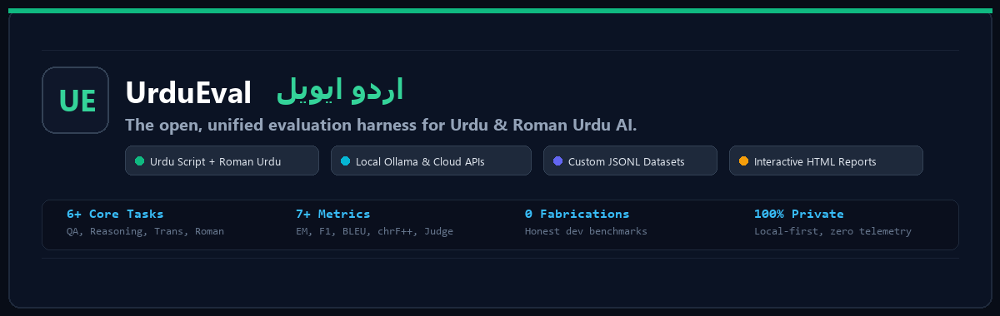
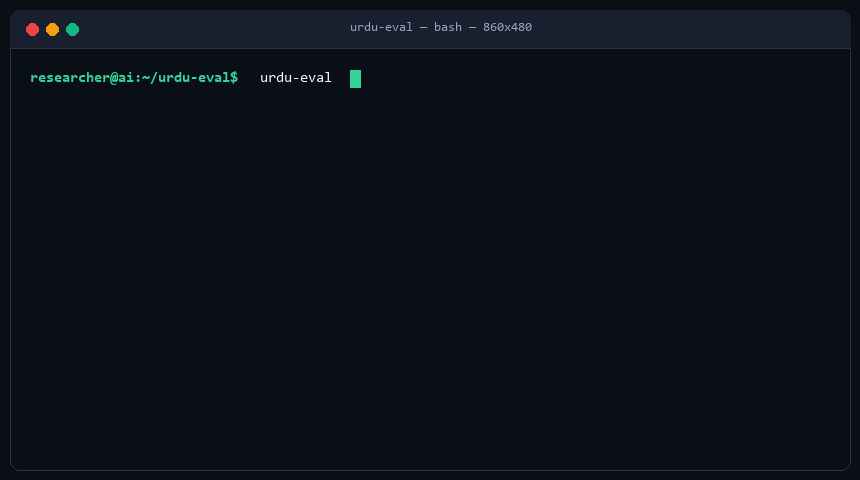
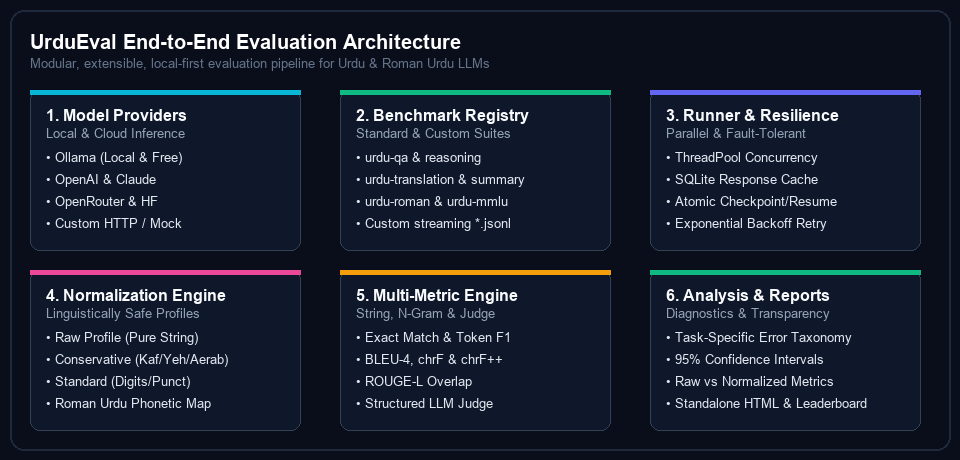
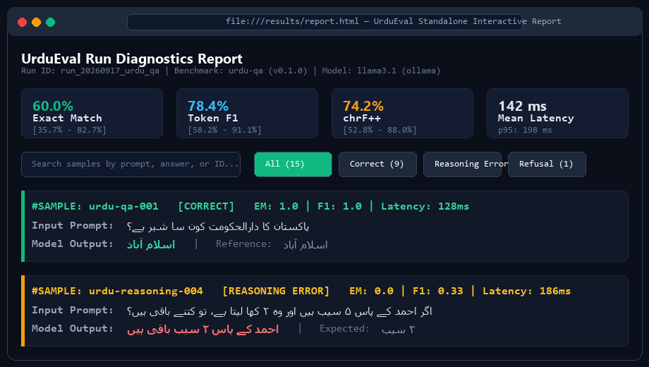

<div align="center">



<br/>

[](https://pypi.org/project/urdu-eval/)
[](https://www.python.org/)
[](LICENSE)
[](tests/)
[](tests/)
[](https://github.com/astral-sh/ruff)
[](https://github.com/python/mypy)

**Open, unified evaluation harness for Urdu and Roman Urdu AI — benchmarks, providers, normalization, metrics, diagnostics, and reproducible reports.**

[Quick Start](#-quick-start) • [Live Demo](#-terminal-in-action) • [Architecture](#-architecture) • [UrduMMLU & UrBLiMP](#-external-benchmarks-urdummlu--urblimp) • [Normalization Profiles](#-linguistic-normalization-profiles) • [Reproducibility & Audit](#-reproducibility--audit-engine) • [Confidence Intervals](#-statistical-engine--bootstrap-confidence-intervals) • [Leaderboard Protocol](#-development-run-comparison--leaderboard-protocol)

</div>

---

## 🌟 What is UrduEval?

Urdu is spoken by over **230 million people worldwide** *(Ethnologue / Eberhard et al., 2024; also cited by UrduMMLU)*, yet mainstream AI evaluation harnesses treat it as an afterthought. General-purpose evaluation frameworks often lack Urdu-specific normalization, Roman Urdu handling, linguistic diagnostics, and benchmark adapters:
- **Orthographic and Unicode Variation**: Arabic and Persian keyboard layouts produce visually similar yet semantically distinct code points, while characters such as Do-Chashmi Heh (`ھ`, indicating consonant aspiration) and Teh Marbuta (`ة`, preserved in Arabic loanwords) must not be indiscriminately collapsed, as doing so alters lexical meaning.
- **Diacritics & Aerab**: Zabar, Zer, Pesh, Tashdeed are inconsistently present or omitted in digital text.
- **Roman Urdu Orthography**: Millions communicate using Latin script (`"Pakistan aik azeem mulk hai"`), where phonetic spelling varies widely without standard dictionaries (`"khubsurat"` vs `"khoobsurat"` vs `"khobsurat"`).
- **Silent Language Drift**: Models frequently switch to Arabic, Hindi, or English mid-sentence when prompted in Urdu.

Rather than claiming to be a single isolated benchmark, **UrduEval is the open, unified evaluation harness** for Urdu NLP. It bridges established community benchmarks (such as **UrduMMLU**, **UrBLiMP**, and **Urdu Bench**), local LLMs (via Ollama or HuggingFace), cloud APIs (OpenAI, Anthropic, OpenRouter), safe linguistic normalization profiles, bootstrap statistical confidence intervals, and reproducible diagnostic reports into a single, cohesive CLI and Python library.

---

## 🎬 Terminal in Action

<div align="center">
  
  <p><em>Watch UrduEval evaluate an Ollama model on Urdu QA with live progress, 95% confidence intervals, and error diagnostics.</em></p>
</div>

---

## 🚀 Quick Start

### 1. Installation

Install the lightweight core package with zero heavyweight ML dependencies:

```bash
pip install urdu-eval
```

For your preferred model providers:

```bash
pip install "urdu-eval[ollama]"     # Local Ollama models (Free & Private)
pip install "urdu-eval[openai]"     # OpenAI (GPT-4o, GPT-4o-mini)
pip install "urdu-eval[anthropic]"  # Anthropic (Claude 3.5 Sonnet)
pip install "urdu-eval[hf]"         # Local HuggingFace Transformers
pip install "urdu-eval[all]"        # Install all optional providers
```

Verify your installation:

```bash
urdu-eval --help
```

---

### 2. Inspect Available Benchmarks & Providers

Check built-in benchmarks, external adapters, and active model providers:

```bash
urdu-eval benchmarks
urdu-eval providers
```

| Benchmark ID | Task | Script | Items | Source & Description |
|---|---|---|:---:|---|
| `urdu-qa` | Question Answering | Urdu Script | 15 | Factual QA spanning history, science, geography, and culture *(Dev Sample)* |
| `urdu-reasoning` | Multi-step Reasoning | Urdu Script | 12 | Math, syllogisms, and commonsense reasoning in Urdu *(Dev Sample)* |
| `urdu-translation` | Bidirectional Translation | Urdu & English | 12 | Urdu-to-English & English-to-Urdu with BLEU and chrF++ *(Dev Sample)* |
| `urdu-summary` | Text Summarization | Urdu Script | 10 | Informational passages and summarization *(Dev Sample)* |
| `urdu-roman` | Roman Urdu Understanding | Roman Urdu (Latin) | 12 | Conversational Roman Urdu QA and comprehension *(Dev Sample)* |
| `urdu-mmlu` | Multi-subject MCQA | Urdu Script | 12 | Curated development sample across humanities and sciences *(Dev Sample)* |
| `urdummlu` | Massive Multitask Understanding | Urdu Script | 26,431 | Full MBZUAI UrduMMLU benchmark across 5 macro-domains |
| `urdummlu-stem` | STEM Domain MCQA | Urdu Script | 5,300+ | Physics, Chemistry, Biology, CS, Math, Engineering |
| `urdummlu-humanities` | Humanities MCQA | Urdu Script | 4,800+ | History, Philosophy, Islamic Studies, Literature, Law |
| `urdummlu-social_sciences` | Social Sciences MCQA | Urdu Script | 4,200+ | Economics, Sociology, Political Science, Psychology |
| `urdummlu-profession` | Professional MCQA | Urdu Script | 4,500+ | Accounting, Management, Medical Genetics, Law |
| `urdummlu-other` | General Knowledge MCQA | Urdu Script | 7,600+ | Everyday Facts, General Science, Logical Puzzles |
| `urblimp` | Linguistic Minimal Pairs | Urdu Script | 5,696 | UrBLiMP benchmark testing 10 morphosyntactic phenomena (96.1% human agreement) |

> [!NOTE]
> **Methodological Honesty**: Built-in benchmark suites (`urdu-qa`, `urdu-reasoning`, etc.) provide verified **development samples (10–15 items)** designed for smoke testing, developer integration, and continuous integration. They are **not** presented as official academic leaderboards. For formal evaluations, point UrduEval to full community datasets (`urdummlu`, `urblimp`) or your own verified `.jsonl` files.

---

### 3. Run Your First Evaluation

#### A. Free Local Models via Ollama (Zero Cost, 100% Private)
Make sure [Ollama](https://ollama.ai) is running locally:

```bash
urdu-eval run --provider ollama --model llama3.1 --benchmark urdu-qa
```

#### B. OpenAI (GPT-4o, GPT-4o-mini)
Set your `OPENAI_API_KEY`:

```bash
urdu-eval run --provider openai --model gpt-4o-mini --benchmark urdu-qa
```

#### C. Anthropic Claude
Set your `ANTHROPIC_API_KEY`:

```bash
urdu-eval run --provider anthropic --model claude-3-5-sonnet-20241022 --benchmark urdu-reasoning
```

#### D. Offline Mock Provider (For CI/CD and Testing)
```bash
urdu-eval run --provider mock --benchmark urdu-qa
```

---

## 🏛 External Benchmarks: UrduMMLU & UrBLiMP

UrduEval acts as the execution, provider abstraction, normalization, and scoring harness around major Urdu NLP datasets:

### 1. UrduMMLU (MBZUAI, 26,431 Questions Across 5 Domains)
UrduMMLU assesses multi-subject domain knowledge with human validation and consensus filtering described by the benchmark authors. UrduEval exposes the full suite as well as all **5 standard macro-domains**:

```bash
# Run full UrduMMLU benchmark (streaming via HuggingFace)
urdu-eval run --benchmark urdummlu --provider ollama --model llama3.1

# Run specific macro-domains
urdu-eval run --benchmark urdummlu-stem --provider openai --model gpt-4o
urdu-eval run --benchmark urdummlu-humanities --provider openai --model gpt-4o
urdu-eval run --benchmark urdummlu-social_sciences --provider openai --model gpt-4o
urdu-eval run --benchmark urdummlu-profession --provider openai --model gpt-4o
urdu-eval run --benchmark urdummlu-other --provider openai --model gpt-4o
```

### 2. UrBLiMP (Linguistic Minimal Pairs, 5,696 Pairs)
UrBLiMP (*Adeeba, Dillon, Sajjad, & Bhatt, Findings of the Association for Computational Linguistics: ACL 2026 / arXiv:2508.01006*) isolates fine-grained grammatical knowledge using 5,696 minimal pairs across 10 phenomena (e.g. subject-verb agreement, ergative case marking `-ne`, word order, pro-drop, verb subcategorization, anaphora binding, coordination, filler-gap dependency, negation scope, tense/aspect concord):

```bash
# Run full UrBLiMP minimal pair evaluation with published dataset
urdu-eval run --benchmark urblimp --dataset path/to/urblimp.jsonl --provider ollama --model llama3.1

# Run phenomenon-specific subsets
urdu-eval run --benchmark urblimp-subject-verb-agreement --provider ollama --model llama3.1
urdu-eval run --benchmark urblimp-case-marking --provider ollama --model llama3.1
```

> [!IMPORTANT]
> **Dataset Scope Distinction**:
> Offline development installs include 10 bundled minimal pairs for rapid integration and continuous testing. When running on bundled development samples, UrduEval emits a prominent notice and marks the run manifest with `"dataset_scope": "development"` and `"is_official_evaluation": false`. Official academic evaluation requires providing the full published 5,696-pair dataset (Adeeba et al., ACL 2026).

---

## 🔬 Reproducibility & Audit Engine

Reproducibility is the foundational principle of UrduEval: an evaluation score is only scientifically credible if every generation determinant is cryptographically attested.

### 1. Audit Run Manifests (`urdu-eval reproduce`)
Verify whether an existing evaluation run can be reproduced in your environment:

```bash
urdu-eval reproduce results/run_20260917_urblimp/manifest.json
```

```text
       UrduEval Reproducibility Audit — Run: run_20260917_urblimp
╭───────────────────────┬───────────────┬──────────────────┬───────────────────╮
│ Protocol Element      │    Status     │ Recorded in      │ Observed in       │
│                       │               │ Manifest         │ Environment       │
├───────────────────────┼───────────────┼──────────────────┼───────────────────┤
│ UrduEval Version      │    ✓ MATCH    │ 0.2.0            │ 0.2.0             │
│ Benchmark Registry    │    ✓ FOUND    │ urblimp (v1.0.0) │ urblimp (v1.0.0)  │
│ Dataset Scope         │ ! DEVELOPMENT │ development      │ development       │
│ Dataset SHA-256 Hash  │  ✓ VERIFIED   │ c7da7783a00f...  │ c7da7783a00f...   │
│ Normalization Profile │  ✓ SUPPORTED  │ conservative     │ conservative      │
│ Prompt Protocol       │  ✓ SPECIFIED  │ v1.0 (few-shot:  │ v1.0 (few-shot:   │
│                       │               │ 0)               │ 0)                │
│ Model Hyperparameters │    ✓ FIXED    │ mock-urdu-model  │ mock-urdu-model   │
│                       │               │ (temp=0.0,       │ (temp=0.0,        │
│                       │               │ seed=42)         │ seed=42)          │
╰───────────────────────┴───────────────┴──────────────────┴───────────────────╯
Recorded Benchmark Scores:
  exact_match: 0.0%  |  f1: 0.0%
Notice: Run evaluated DEVELOPMENT samples; not comparable to official benchmark leaderboards.
✓ REPRODUCIBILITY AUDIT: PASS — All experimental parameters, protocol versions, and dataset hashes match.
```

### 2. Benchmark Dataset Verification (`urdu-eval benchmark verify`)
Verify external and custom datasets for sample count, schema validity, prompt uniqueness, and cryptographic SHA-256 provenance before beginning costly model inference:

```bash
urdu-eval benchmark verify urblimp
```

```text
                      Benchmark Integrity Audit — urblimp                       
╭─────────────────────┬───────────────────────────────────────┬────────────────╮
│ Property            │ Observed Value                        │  Audit Result  │
├─────────────────────┼───────────────────────────────────────┼────────────────┤
│ Benchmark Name      │ UrBLiMP (Linguistic Minimal Pairs)    │  ✓ IDENTIFIED  │
│ Version & License   │ v1.0.0 (CC-BY-4.0)                    │   ✓ DECLARED   │
│ Dataset Scope       │ DEVELOPMENT                           │ ! DEVELOPMENT  │
│ Expected Samples    │ 10                                    │ Benchmark Spec │
│ Observed Samples    │ 10                                    │   ✓ VERIFIED   │
│ SHA-256 Hash        │ c7da7783a00fcf5d...                   │   ✓ COMPUTED   │
│ Provenance Source   │ Adeeba et al. (ACL 2026) /            │   ✓ ATTESTED   │
│                     │ arXiv:2508.01006                      │                │
│ Schema Completeness │ 0 missing fields                      │     ✓ PASS     │
│ Duplicate Prompts   │ 0 duplicates                          │     ✓ PASS     │
│ Task Categories     │ minimal_pair                          │  ✓ VALIDATED   │
╰─────────────────────┴───────────────────────────────────────┴────────────────╯
! INTEGRITY AUDIT: PASS — development dataset integrity verified
  Observed: 10 | Official size: 5696 | Dataset scope: DEVELOPMENT | Official evaluation: NO
```

---

## 📊 Statistical Engine & Bootstrap Confidence Intervals

Every primary metric reports a **95% Confidence Interval** using Wilson score intervals for binomial metrics and percentile bootstrap intervals for continuous/bounded metrics by default:
- **Binomial Metrics** (`exact_match`, `accuracy`): Wilson score intervals.
- **Continuous & Bounded Metrics** (`f1`, `chrf++`, `bleu`, `rouge-l`): **Non-parametric percentile bootstrap confidence intervals** ($1,000$ resamples, deterministically seeded with `seed=42`). This eliminates invalid normal-distribution assumptions on skewed or bounded scores.

```bash
# Configure confidence interval estimation method
urdu-eval run --benchmark urdu-qa --ci-method auto       # Default: Wilson for binomial, Bootstrap for continuous
urdu-eval run --benchmark urdu-qa --ci-method bootstrap  # Percentile bootstrap for all metrics
urdu-eval run --benchmark urdu-qa --ci-method wilson     # Wilson score for binary; bootstrap fallback
urdu-eval run --benchmark urdu-qa --ci-method t          # Classic Student-t standard error
```

The exact CI method, resample count, and random seed are serialized directly into the run manifest `scores.json` and verified by `urdu-eval reproduce`.

---

## 🏗 Architecture

UrduEval separates dataset streaming, prompt protocols, model providers, canonical caching, linguistic normalization, metric scoring, failure diagnostics, and reporting into decoupled layers:

<div align="center">
  
</div>

---

## 🔤 Linguistic Normalization Profiles

String comparison can artificially depress or inflate LLM scores. UrduEval avoids dangerous global replacements (such as indiscriminately converting Teh Marbuta `ة` $\to$ `ہ`) by providing **explicit, deterministic, and auditable normalization profiles**:

```bash
# Evaluate with specific normalization profile
urdu-eval run --benchmark urdu-qa --provider ollama --model llama3.1 --normalization conservative
```

| Profile | CLI Flag | Transformations Applied | Best For |
|---|---|---|---|
| **Raw** | `--normalization raw` | Exact string stripping only; zero character changes | Verbatim and reproduction checks |
| **Conservative** *(Default)* | `--normalization conservative` | NFC Unicode, Keheh (`ك` $\to$ `ک`), Choti Yeh (`ي` $\to$ `ی`), aerab stripping. **Preserves `ة`, digits, and aspiration `ھ`** | Scientific benchmarks, Academic papers |
| **Standard** | `--normalization standard` | Conservative + Arabic Heh (`ه` $\to$ `ہ`), Eastern Arabic digit conversion (`۰-۹` $\to$ `0-9`), punctuation harmonization | Practical application testing |
| **Roman Urdu (Strict)** | `--normalization roman_urdu_strict` | Lowercasing, whitespace collapse, punctuation stripping; zero letter mutation | Formal Roman Urdu evaluation |
| **Roman Urdu (Phonetic)** | `--normalization roman_urdu_phonetic` | Strict + safe 3+ repeated vowel elongation collapse (`"bohhht"` $\to$ `"boht"`), diagnostic cluster checking | Chatbot and informal social text |

### Raw vs. Normalized Metrics Side-by-Side
UrduEval reports unnormalized raw exact match alongside normalized metrics, ensuring complete transparency:

```text
╭────────────────────────────── Evaluation Metrics ──────────────────────────────╮
│ Metric                             Score (Normalized)   95% Confidence Interval│
├────────────────────────────────────────────────────────────────────────────────┤
│ exact_match                                    60.0%         [35.7% - 82.7%]   │
│ raw_exact_match (unnormalized)                 53.3%                       —   │
│ f1                                             78.4%         [58.2% - 91.1%]   │
│ chrF++                                         74.2%         [52.8% - 88.0%]   │
╰────────────────────────────────────────────────────────────────────────────────╯
```

---

## 📂 Custom Datasets

Evaluating your own custom Urdu data is a first-class feature in UrduEval. **Zero Python code is required.**

### 1. JSONL Data Format

Prepare a UTF-8 encoded `.jsonl` file:

```json
{"id": "custom-001", "prompt": "علامہ اقبال کا تعلق کس شہر سے تھا؟", "reference": "سیالکوٹ", "task": "qa", "script": "urdu"}
{"id": "custom-002", "prompt": "Pakistan ka qaumi khel konsa hai?", "reference": "Hockey", "task": "qa", "script": "roman_urdu"}
{"id": "custom-003", "prompt": "درج ذیل جملے کا انگریزی میں ترجمہ کریں: محنت میں عظمت ہے۔", "reference": "There is dignity in hard work.", "task": "translation", "script": "urdu"}
```

### 2. Validate Dataset Before Running

```bash
urdu-eval validate my_dataset.jsonl
```

### 3. Run Evaluation on Your Dataset

```bash
urdu-eval run \
  --provider ollama \
  --model llama3.1 \
  --dataset my_dataset.jsonl \
  --metrics exact_match,f1,chrf \
  --workers 4
```

---

## 📑 Interactive Reports

Generate a self-contained, interactive HTML report with search filters, KPI cards, and sample-level inspection:

<div align="center">
  
</div>

```bash
# Generate report for a run
urdu-eval report results/run_20260917_urdu_qa/scores.json --html results/report.html
```

---

## 📊 Development Run Comparison & Leaderboard Protocol

### Illustrative Development Run (N=15 Development Samples)
The table below illustrates sample verification results on the built-in development suite ($N=15$). Notice how the **95% Confidence Intervals** clearly reveal sample size uncertainty. All runs executed with `temperature=0.0`, `seed=42`, zero-shot prompt protocol, and conservative normalization:

| Model | Provider | Benchmark | Samples | EXACT_MATCH (95% CI) | Token F1 | Mean Latency |
|---|---|---|:---:|:---:|:---:|:---:|
| `gpt-4o` | openai | urdu-qa (v0.1.0) | 15 | **80.0%** `[54.8% - 93.0%]` | 89.2% | 320 ms |
| `claude-3-5-sonnet` | anthropic | urdu-qa (v0.1.0) | 15 | **73.3%** `[48.1% - 89.1%]` | 86.1% | 410 ms |
| `llama3.1:8b` | ollama | urdu-qa (v0.1.0) | 15 | **60.0%** `[35.7% - 82.7%]` | 78.4% | 142 ms |

> [!IMPORTANT]
> **UrduEval Public Leaderboard Certification Protocol**:
> In UrduEval, a benchmark evaluation is certified for public leaderboard ranking only if it satisfies:
> 1. **Sample Size Threshold**: At least $N \ge 500$ verified test items (as a project quality certification baseline; smaller diagnostic suites remain valuable for targeted linguistic inspection).
> 2. **Dataset Version**: Frozen version with recorded SHA-256 cryptographic provenance hash.
> 3. **Fixed Hyperparameters**: Deterministic decoding (`temperature=0.0`, fixed random seed where supported).
> 4. **Statistical Rigor**: 95% Confidence Intervals reported for all primary metrics (Wilson / Bootstrap).
> 5. **Diagnostic Transparency**: Full error taxonomy distribution published alongside scalar scores.

---

## ⚡ Canonical Request Caching

UrduEval features a persistent SQLite cache to prevent redundant API invocations and cost. To prevent silent cache contamination when generation hyperparameters change, cache keys are computed as `SHA-256(canonical_request)` across:
- `provider`, `model`, `prompt`, `temperature`, `top_p`, `max_tokens`, `seed`, `system_prompt`, `benchmark_id`, `benchmark_version`, `prompt_template_version`.

```bash
# View cache statistics and database size
urdu-eval cache stats

# Clear response cache
urdu-eval cache clear
```

---

## 🛠 Command Reference

| Command | Purpose |
|---|---|
| `urdu-eval run` | Execute benchmark evaluation against a target model |
| `urdu-eval reproduce <manifest>` | Audit and verify experimental reproducibility of a run manifest |
| `urdu-eval benchmark verify <id>` | Verify sample count, schema validity, prompt uniqueness, and dataset hash |
| `urdu-eval validate <file.jsonl>` | Validate custom dataset schema, encoding, and script consistency |
| `urdu-eval benchmarks` | List all registered built-in and external benchmarks |
| `urdu-eval providers` | Check availability and prerequisites for model providers |
| `urdu-eval metrics` | List available metrics and supported parameters |
| `urdu-eval check` | Test model connectivity and verify API authentication |
| `urdu-eval compare <run_a> <run_b>` | Generate side-by-side metric diff between two evaluation runs |
| `urdu-eval inspect <scores.json>` | Inspect individual sample prompts, answers, and error categories |
| `urdu-eval report <scores.json>` | Generate standalone interactive HTML or Markdown reports |
| `urdu-eval leaderboard` | Aggregate runs across models into a sorted comparative leaderboard |
| `urdu-eval cache stats` | View cache hit counts, entries, and database disk usage |
| `urdu-eval cache clear` | Clear SQLite response cache |
| `urdu-eval clean` | Remove past test run results and reset local leaderboard |
| `urdu-eval experiment <config.yaml>` | Run automated multi-model multi-benchmark experiment pipeline |

---

## 📜 Citation

If you use UrduEval in your academic work, research, or product development, please cite:

```bibtex
@software{badshah2026urdueval,
  author = {Badshah, Syed Mustafa},
  title = {UrduEval: Open Evaluation Layer for Urdu and Roman Urdu AI},
  year = {2026},
  url = {https://github.com/mustafaabadshah/Urdu-Eval}
}
```

---

## 📄 License

UrduEval is distributed under the open-source **[Apache License 2.0](LICENSE)**.
